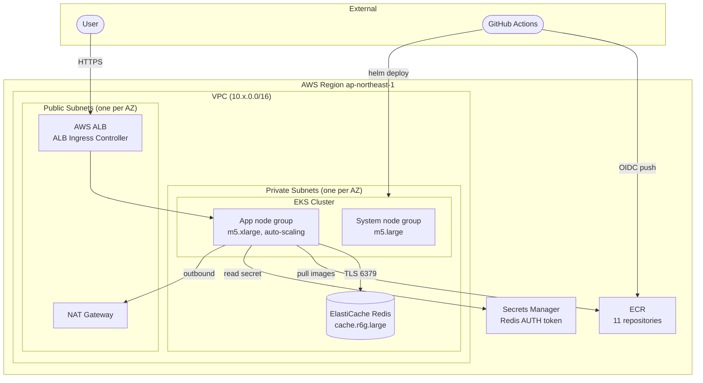

# Architecture

## Application Architecture

11 microservices communicating over gRPC, with the frontend as the only externally-exposed service.

```mermaid
graph LR
    User([User]):::external
    LG([loadgenerator\nnon-prod only]):::external

    User -->|HTTPS| ALB[AWS ALB]
    LG  -->|HTTP|  ALB

    ALB -->|HTTP| FE[frontend\nGo]

    FE -->|gRPC| CART[cartservice\nC#]
    FE -->|gRPC| PC[productcatalogservice\nGo]
    FE -->|gRPC| CUR[currencyservice\nNode.js]
    FE -->|gRPC| CO[checkoutservice\nGo]
    FE -->|gRPC| REC[recommendationservice\nPython]
    FE -->|gRPC| AD[adservice\nJava]
    FE -->|gRPC| SHIP[shippingservice\nGo]

    CO -->|gRPC| CART
    CO -->|gRPC| PC
    CO -->|gRPC| CUR
    CO -->|gRPC| SHIP
    CO -->|gRPC| EMAIL[emailservice\nPython]
    CO -->|gRPC| PAY[paymentservice\nNode.js]

    CART -->|TLS + AUTH| REDIS[(ElastiCache\nRedis)]:::datastore

    classDef external fill:#f5f5f5,stroke:#999
    classDef datastore fill:#fff3cd,stroke:#f0ad4e
```

**Key points:**
- `frontend` is the only service exposed through the ALB — all other services are internal
- `checkoutservice` is the main orchestrator — it calls 6 downstream services per order
- `cartservice` is the only stateful service — backed by AWS ElastiCache Redis (replaces upstream in-cluster Redis)
- `loadgenerator` is enabled in dev/test/perf only (`loadgenerator.enabled: false` in staging and prod)

---

## Infrastructure Architecture



**Design principles:**
- **Environment isolation**: Each environment has its own VPC, EKS cluster, and ElastiCache instance (non-overlapping CIDRs)
- **Least privilege**: EKS nodes access Secrets Manager and ECR via IRSA — no long-lived credentials
- **Private by default**: EKS nodes and Redis sit in private subnets; only the ALB is in the public subnet
- **Cost gradient**: dev/test use `t3.micro` Redis + single NAT Gateway; prod uses `r6g.large` Redis + per-AZ NAT Gateways
- **Network security**: Redis security group allows port 6379 only from EKS node security group; VPC Flow Logs enabled (7-day retention in dev, 90-day in prod)

### VPC CIDR Allocation

| Environment | Region | VPC CIDR |
|-------------|--------|----------|
| dev | ap-northeast-1 (Tokyo) | 10.10.0.0/16 |
| test | ap-northeast-1 (Tokyo) | 10.11.0.0/16 |
| perf — primary | ap-northeast-1 (Tokyo) | 10.12.0.0/16 |
| perf — secondary | us-east-1 (Virginia) | 10.14.0.0/16 |
| staging — primary | ap-northeast-1 (Tokyo) | 10.13.0.0/16 |
| staging — secondary | us-east-1 (Virginia) | 10.15.0.0/16 |
| prod — primary | ap-northeast-1 (Tokyo) | 10.0.0.0/16 |
| prod — secondary | us-east-1 (Virginia) | 10.1.0.0/16 |

### prod Environment Specifications

| Component | Spec | Count |
|-----------|------|-------|
| EKS system nodes | m5.large | 3 (spread across AZs) |
| EKS app nodes | m5.xlarge | 6–50 (auto-scaling) |
| ElastiCache Redis | cache.r6g.large | 3 (Multi-AZ failover) |
| NAT Gateway | — | 3 (one per AZ) |

### Multi-Region Environments (perf / staging / prod)

perf, staging, and prod each deploy two full stacks — Tokyo (primary) and Virginia (secondary) — managed from a single Terraform state file using provider aliases.

| Component | perf Tokyo | perf Virginia | staging Tokyo | staging Virginia | prod Tokyo | prod Virginia |
|-----------|-----------|---------------|---------------|------------------|------------|---------------|
| VPC CIDR | 10.12.0.0/16 | 10.14.0.0/16 | 10.13.0.0/16 | 10.15.0.0/16 | 10.0.0.0/16 | 10.1.0.0/16 |
| EKS app nodes | 3–20 | 1–10 | 2–10 | 2–8 | 3–50 | 3–50 |
| ElastiCache | r6g.large × 2 | r6g.large × 1 | r6g.large × 2 | r6g.large × 2 | r6g.large × 3 | r6g.large × 3 |

---

## Pipeline Architecture

### Service Pipeline

Triggered on every push / PR. Build and deploy stages only run under specific conditions.

```mermaid
flowchart TD
    A([push / PR / workflow_dispatch]) --> B

    B[helm lint\nall environments]
    B --> C[unit tests\nmatrix: Go · Node.js · Python · .NET · Java]
    C --> D[Trivy scan\nnon-blocking]
    D --> E{branch = main?}

    E -->|No| Z([end])
    E -->|Yes| F[build & push to ECR\nmatrix: 11 services\ntag: sha-SHORT_SHA]

    F --> G[deploy → dev\nautomatic]
    G --> H{workflow_dispatch\n+ environment input?}

    H -->|environment = test|     I[deploy → test]
    H -->|environment = perf|     J[deploy → perf]
    H -->|environment = staging|  K[deploy → staging\nrequires approval]
    H -->|environment = prod|     L[deploy → prod\nrequires approval]
```

### Infra Pipeline

Triggered on push to `main` (auto-applies dev) or `workflow_dispatch` (manual control for all environments).

```mermaid
flowchart TD
    A([push to main\nor workflow_dispatch]) --> B

    B[validate\nterraform fmt · tflint · Checkov]
    B --> C[terraform plan\n5 environments in parallel]
    C --> D{trigger type?}

    D -->|push to main| E[apply → dev\nautomatic]
    D -->|workflow_dispatch\nenvironment=dev + action=apply| E

    D -->|workflow_dispatch\nenvironment=test + action=apply|    F[apply → test]
    D -->|workflow_dispatch\nenvironment=perf + action=apply|    G[apply → perf]
    D -->|workflow_dispatch\nenvironment=staging + action=apply| H[apply → staging\nrequires approval]
    D -->|workflow_dispatch\nenvironment=prod + action=apply|    I[apply → prod\nrequires approval]
```

### Key Design Points

**OIDC authentication — no long-lived keys**  
GitHub Actions authenticates to AWS using OIDC JWT tokens. Separate IAM roles are used for build (`AWS_ROLE_ARN_BUILD`, ECR push only) and deploy (`AWS_ROLE_ARN_<ENV>`, EKS access), each scoped to the specific environment.

**Immutable image tags**  
Every image is tagged `sha-<short-sha>`. ECR repositories enforce immutable tags, preventing accidental overwrites.

**Redis connection string injected at deploy time**  
The pipeline retrieves the ElastiCache endpoint and AUTH token from AWS Secrets Manager at deploy time and constructs a full StackExchange.Redis connection string (`host:6379,password=...,ssl=true`). This is written to a temp values file rather than passed via `--set` (commas in the value break Helm's `--set` parsing).

**loadgenerator excluded from staging and prod**  
`values-staging.yaml` and `values-prod.yaml` both set `loadgenerator.enabled: false`, ensuring synthetic load never reaches production.

**Approval gates**  
staging and prod deployments require manual approval via GitHub Environment protection rules — separate from the `if` condition checks.
